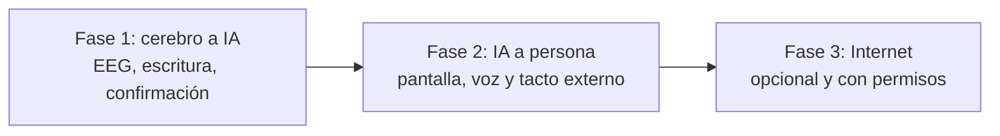
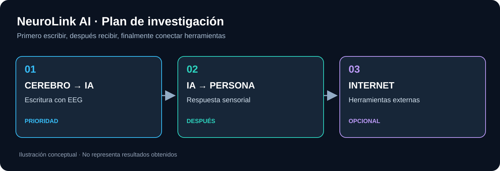

# Tres fases — fuente editable

```mermaid
flowchart LR
    A["Fase 1: cerebro a IA<br/>EEG, escritura, confirmación"]
    B["Fase 2: IA a persona<br/>pantalla, voz y tacto externo"]
    C["Fase 3: Internet<br/>opcional y con permisos"]
    A --> B --> C
```

[Más detalles](../docs/simple/02-las-fases.md).
